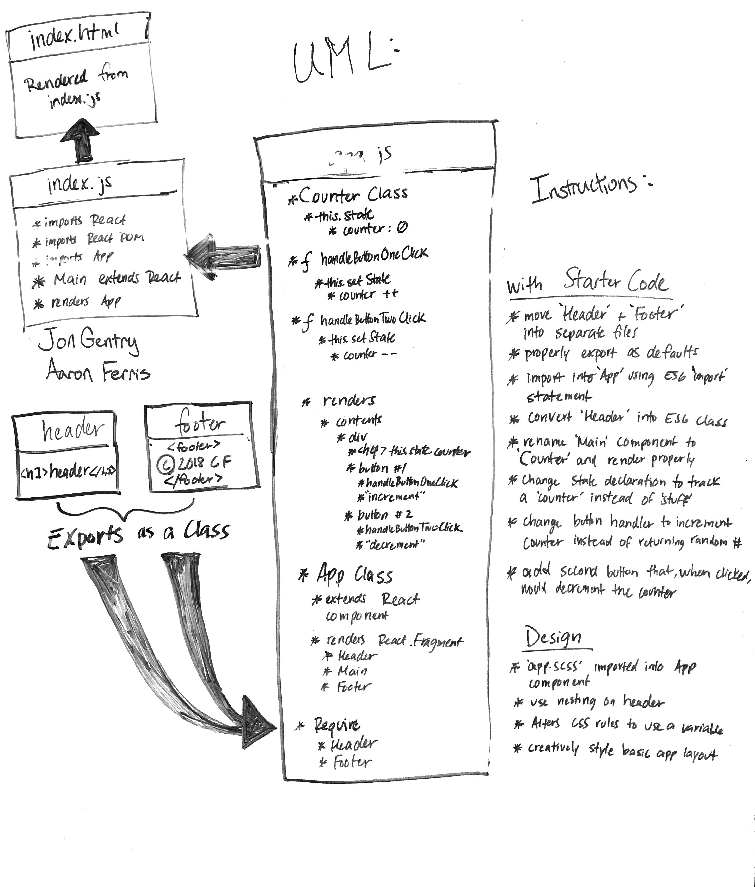

#  LAB 26

## Component Based UI

### Author: Aaron Ferris
#### UML Done with Jon Gentry

### Links and Resources

- [Pull Request](https://github.com/abferris/lab26/pull/1)
- [front-end sandbox result](https://24q3om23or.codesandbox.io/) 
- [front-end sandbox code](https://codesandbox.io/s/24q3om23or)

#### Tasks

##### React

[x] Move the Header and Footer components to separate files  
[x] Properly export them as defaults  
[x] Import them into the App Component using ES6 import statement  
[x] Convert the Header component to an ES6 Class  
[x] Rename the Main component to Counter and render it properly  
[x] Change the state declaration to track a counter instead of stuff  
[x] Change the button handler to increment the counter instead of returning a random number.  
[x] Add a second button that, when clicked, would decrement the counter  
[x] Convert the buttons to links

#####SCSS
[x] Create a file called app.scss and import that into the App component  
[x] Add some creatove styling for the header, making use of SASS nesting  
[x] Alter the app.scss as follows:  
  [x] Alter your css rules to use a variable (i.e. \$backgroundColor)  
  [x] Start getting creative about styling the basic layout of the app  
  [x] Might things change when the counter is > 0 or < 0?  
  [x] Where would the buttons look best?  
  [x] Can you make the number “pop”

#### UML

